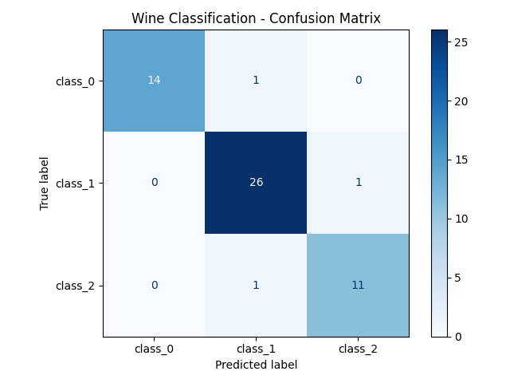

# Docker Lab - Wine Classification using Gradient Boosting

## Overview
A Dockerized machine learning pipeline that trains a Gradient Boosting Classifier on the Wine dataset, evaluates performance, and generates a confusion matrix visualization.

## Tech Stack
- Python 3.10
- Scikit-learn
- Matplotlib
- Docker

## What it does
1. Loads the Wine dataset (178 samples, 13 features, 3 classes)
2. Splits data into training (70%) and testing (30%)
3. Trains a Gradient Boosting Classifier (150 estimators, learning rate 0.1)
4. Prints accuracy and a detailed classification report
5. Generates and saves a confusion matrix heatmap
6. Saves the trained model as `wine_model.pkl`

## How to Run

### Build the Docker image
```
docker build -t lab1:v1 .
```

### Run the container
```
docker run lab1:v1
```

### Save the image as a tar file
```
docker save lab1:v1 > my_image.tar
```

### Extract confusion matrix from the container
```
docker cp <container_id>:/app/confusion_matrix.png .
```

## Results

### Model Accuracy: 94.44%

### Classification Report
| Class   | Precision | Recall | F1-Score |
|---------|-----------|--------|----------|
| class_0 | 1.00      | 0.93   | 0.97     |
| class_1 | 0.93      | 0.96   | 0.95     |
| class_2 | 0.92      | 0.92   | 0.92     |

### Confusion Matrix


## Project Structure
```
├── dockerfile
├── ReadMe.md
├── confusion_matrix.png
└── src/
    ├── main.py
    └── requirements.txt
```
